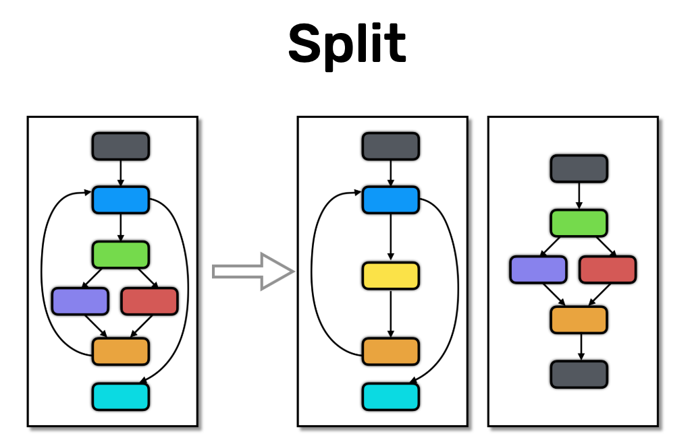

# Rapport

# Split transformation



**Sources**:
https://tigress.wtf/split.html

**Transformation**
La transformation **split** permet de décomposer une fonction en plusieurs sous-fonction.

**Comment Tigress fait la transformation Split**
Il y a plusieurs méthodes de split que l'on peut spécifier avec les options (Default=top,block,deep,recursive).
- top = split the top-level list of statements into two functions funcname_split_1 and funcname_split_2.
- block = split a basic block (list of assignment and call statements) into two functions.
- deep = split out a nested control structure of at least height>2 into its own function funcname_split_1.
- recursive = same as block, but calls to split functions are also allowed to be split out.
- level = split out a statement at a level specified by --SplitLevel.
- inside = split out a statement at the innermost nesting level.

Donc on comprend que tigress de base split le main() en 2 fonctions.
Chaque basic bloc (suite d'instructions qui seront tjrs faites dans le même ordre) sera split en 2 avec une partie pour les assignements et une autre pour les appels.
Chaque structure de contrôle est aussi décomposé sur sa profondeur.
Enfin chaque sous-fonction pourra aussi être redécomposée.

**Comment déobfusquer la transformation Split**
Le décompilateur arrive a bien décompiler cette transformation. 
Pour revenir au code original, il suffit de remplacer les appels de fonction par leur code.
Nous pensons que cela peut s'automatiser.

## Exemple de transformation d'un if

```c
// Original
int main(){
  int condition = 1;
  if(condition == 1 ) {
    printf("true");
  } else {
    printf("false");
  }
  return 0;
}
```
```c
// Objfusqué par Split
void _1_main_main_split_1(int *condition ){
    {
    *condition = 1;
    }
}

void _1_main_main_split_2(int *condition ){
  {
    if (*condition == 1) {
      printf((char const   */* __restrict  */)"true");
    } else {
      printf((char const   */* __restrict  */)"false");
    }
  }
}

int main(int _formal_argc , char **_formal_argv , char **_formal_envp ) 
{ 
  int condition ;
  int _BARRIER_0 ;

  {
  megaInit();
  _global_argc = _formal_argc;
  _global_argv = _formal_argv;
  _global_envp = _formal_envp;
  _BARRIER_0 = 1;
  _1_main_main_split_1(& condition);
  _1_main_main_split_2(& condition);
  return (0);
}
```
```c
// Décompilé
void _1_main_main_split_1(undefined4 *param_1){
  *param_1 = 1;
  return;
}

void _1_main_main_split_2(int *param_1){
  if (*param_1 == 1) {
    printf("true");
  }
  else {
    printf("false");
  }
  return;
}

undefined8 main(undefined4 param_1,undefined8 param_2,undefined8 param_3){
  undefined local_10 [4];
  undefined4 local_c;
  
  megaInit();
  local_c = 1;
  _global_argv = param_2;
  _global_argc = param_1;
  _global_envp = param_3;
  _1_main_main_split_1(local_10);
  _1_main_main_split_2(local_10);
  return 0;
}
```

## Exemple d'un if_arg

```c
// Original
int main(int argc, char* argv[]){
  if(strcmp(argv[1], "1") == 0 ) {
    printf("true\n");
  } else {
    printf("false\n");
  }
  return 0;
}
```

```c
// Obfusqué
void _1_main_main_split_1(char ***argv , int *tmp ){
  {
    *tmp = strcmp((char const   *)*(*argv + 1), "1");
  }
}

void _1_main_main_split_2(int *tmp ){
  {
    if (*tmp == 0) {
      printf((char const   */* __restrict  */)"true\n");
    } else {
      printf((char const   */* __restrict  */)"false\n");
    }
  }
}

int main(int argc , char **argv , char **_formal_envp ){ 
  int tmp ;
  int _BARRIER_0 ;

  {
    megaInit();
    _global_argc = argc;
    _global_argv = argv;
    _global_envp = _formal_envp;
    _BARRIER_0 = 1;
    _1_main_main_split_1(& argv, & tmp);
    _1_main_main_split_2(& tmp);
    return (0);
  }
}
```

```c
// Décompilé
void _1_main_main_split_1(long *param_1,int *param_2){
  int iVar1;
  
  iVar1 = strcmp(*(char **)(*param_1 + 8),"1");
  *param_2 = iVar1;
  return;
}

void _1_main_main_split_2(int *param_1){
  if (*param_1 == 0) {
    puts("true");
  }
  else {
    puts("false");
  }
  return;
}

undefined8 main(undefined4 param_1,undefined8 param_2,undefined8 param_3){
  undefined8 local_28;
  undefined4 local_1c;
  undefined local_10 [4];
  undefined4 local_c;
  
  local_28 = param_2;
  local_1c = param_1;
  megaInit();
  _global_argc = local_1c;
  _global_argv = local_28;
  local_c = 1;
  _global_envp = param_3;
  _1_main_main_split_1(&local_28,local_10,local_10);
  _1_main_main_split_2(local_10);
  return 0;
}
```


