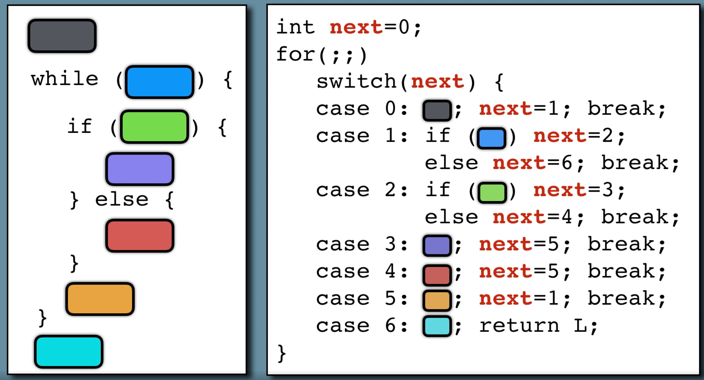

# Flatten transformation




**Sources**:
https://tigress.wtf/flatten.html

**Transformation**
Cette transformation permet d'enlever les flow de contrôle.

**Comment Tigress fait la transformation Split**
Tigress met au même niveau tous les blocs basiques puis saute de bloc en bloc.
Il crée une variable next qui a la valeur du prochain bloc où aller.

Une option permet de split les blocs basics et donc de rajouter encore plus de case dans le switch.

Une option permet d'obfusquer directement la varaible next avec les transformations opaque predicates et anti-implicit flow.

Il y a différentes manières de "dispatch" les blocks, c'est à dire de sauter de bloc en bloc.
- switch (default)
  Chaque block est un case d'un grand switch, inclut dans une boucle while infinie.
- goto (voir ex)
  Des gotos sont utilisés pour aller de bloc en bloc.
- indirect (voir ex)
  On utilise des goto pour aller de bloc en bloc, avec les valeurs de ces goto dans une jump table.
- call (voir ex)
  Chaque bloc devient sa propre fonction. On va de fonction en fonction en faisant à une table contenant les pointeurs des fonctions.

Les tests conditionnels peuvent être encodés de différentes manières.
Une option permet de changer la manière dont est transformée un test conditionnel. Cela permet de les enlever du code et de les gérer directement au niveau de l'assembleur.
branch: utilisation de branches normales (if)
compute: calcule la branche (x=(a>b); goto *(expression over x))
flag: calcule la branche selon l'état du registre flag (asm("cmp a b;pushf;pop"); goto *(expression over flag register))

(Explication)

(Rq: ...)

En conclusion, ...

**Comment déobfusquer la transformation Split**
Dans tous les cas, la décompilation n'arrive pas à recréer un switch.
Il faut réussir à identifier la variable qui conditionne les sauts entre les blocs et arriver à retracer l'ordre d'exécution des différents blocs à partir de celle-ci.

Selon la gestion des test conditionnels (branch, compute, flag), il est plus difficile de suivre la valeur de la variable "next" qui indique le saut au prochain bloc.
Avec l'option branch, on lui attribue directement la valeur `local_18 = 3`.
Avec l'option compute, elle est calculée `addr11 = (void *)(r9 * _1_main_then7 + notr10 * _1_main_else8);`
Avec l'option flag, elle est calculée à partir d'une fonction qui a l'air de reproduire le calcul de la condition (comme pour mettre l'état du flag) `__cil_tmp9 = _1_main_flag_func_0(number, 10, _1_main_then7, _1_main_else8);`

Lorsque l'on remarque un `/* WARNING (jumptable)*/` dans le code décompilé. On peut savoir que le dispatch des blocs se fait avec l'option goto ou indirect.
Si on rencontre cette transformation, alors on ne pourra pas le déobfusquer. (Ou trouver une solution mais on la cherchera si on rencontre ce problème).
Sinon le dispatch sera à partir de switch.

**Exemples**
Dans ces exemples on a utilisation la transformation par défaut (switch dispatch).

## Exemple de transformation d'un if

```c
// Original
int main() {
  int number = 10;
  if(number >= 10){ printf("True"); }
  return 0;
}
```

<table style="width: 700px;"><tr><th>
Obfusqué
</th>
<th>
Décompilé
</th></tr>
<tr><td style="max-width:350px;"><pre>
int main(int _formal_argc , char **_formal_argv , char **_formal_envp ) 
{ 
  int number ;
  unsigned long _1_main_next ;
  _1_main_next = 2UL;
  while (1) {
    switch (_1_main_next) {
    case 1: 
    printf((char const   */* __restrict  */)"True");
      _1_main_next = 3UL;
      break;
    case 3: ;
      return (0);
      break;
    case 0: ;
      if (number >= 10) {
        {
        _1_main_next = 1UL;
        }
      } else {
        {
        _1_main_next = 3UL;
        }
      }
      break;
    case 2: 
      number = 10;
      _1_main_next = 0UL;
      break;
    }
  }
}
</pre></td>
<td style="max-width: 350px"><pre>
undefined8 main(undefined4 param_1,undefined8 param_2,undefined8 param_3){
  ulong local_18;
  int local_c;
  local_18 = 2;
  while (local_18 != 3) {
    if (local_18 < 4) {
      if (local_18 == 2) {
        local_c = 10;
        local_18 = 0;
      }
      else {
        if (local_18 < 3) {
          if (local_18 == 0) {
            if (local_c < 10) {
              local_18 = 3;
            }
            else {
              local_18 = 1;
            }
          }
          else {
            if (local_18 == 1) {
              printf("True");
              local_18 = 3;
            }
          }
        }
      }
    }
  }
  return 0;
}
</pre></td></tr></table>

## Exemple de transformation d'un for
```c
// Original
int main() {
	int i = 1;
	long long fact = 1;
	int number = 3;
	for(i=1; i <= number; i++){
	  fact = fact * i;
	}
	printf("Factorial of %d is: %ld\n",number,fact);    
	return 0;  
}
```

```c
// Objfusqué
int main(int _formal_argc , char **_formal_argv , char **_formal_envp ) 
{ 
  int i ;
  long long fact ;
  int number ;
  unsigned long _1_main_next ;
  _1_main_next = 5UL;
  while (1) {
    switch (_1_main_next) {
    case 3: ;
        return (0);
        break;
    case 6: 
        printf((char const   */* __restrict  */)"Factorial of %d is: %ld\n", number, fact);
        {
        _1_main_next = 3UL;
        }
        break;
    case 5: 
        i = 1;
        fact = 1LL;
        number = 3;
        i = 1;
        {
        _1_main_next = 2UL;
        }
        break;
    case 0: 
        fact *= (long long )i;
        i ++;
        {
        _1_main_next = 2UL;
        }
    break;
    case 2: ;
        if (i <= number) {
          {
          _1_main_next = 0UL;
          }
        } else {
          {
          _1_main_next = 6UL;
          }
        }
        break;
    }
  }
}
```
```c
// Décompilé
undefined8 main(undefined4 param_1,undefined8 param_2,undefined8 param_3){
  undefined8 local_28;
  uint local_1c;
  long local_18;
  int local_c;
  local_28 = 5;
  do {
    switch(local_28) {
    case 0:
      local_18 = local_c * local_18;
      local_c = local_c + 1;
      local_28 = 2;
      break;
    case 2:
      if ((int)local_1c < local_c) {
        local_28 = 6;
      }
      else {
        local_28 = 0;
      }
      break;
    case 3:
      return 0;
    case 5:
      local_18 = 1;
      local_1c = 3;
      local_c = 1;
      local_28 = 2;
      break;
    case 6:
      printf("Factorial of %d is: %ld\n",(ulong)local_1c,local_18);
      local_28 = 3;
    }
  } while( true );
}
```

## Exemple de transformation d'un while
```c
// Original
int main() {
	int i = 1;
	long long fact = 1;
	int number = 3;
	while (i <= number) {
		fact = fact * i;
		i++;
	}
	printf("Factorial of %d is: %ld\n",number,fact);
	return 0;  
}
```
```c
// Objfusqué
int main(int _formal_argc , char **_formal_argv , char **_formal_envp ) 
{ 
  int i ;
  long long fact ;
  int number ;
  unsigned long _1_main_next ;
  _1_main_next = 5UL;
  while (1) {
    switch (_1_main_next) {
    case 3: ;
    return (0);
    break;
    case 6: 
        printf((char const   */* __restrict  */)"Factorial of %d is: %ld\n", number, fact);
        _1_main_next = 3UL;
        break;
    case 5: 
        i = 1;
        fact = 1LL;
        number = 3;
        _1_main_next = 2UL;
        break;
    case 0: 
        fact *= (long long )i;
        i ++;
        _1_main_next = 2UL;
        break;
    case 2: ;
        if (i <= number) {
          _1_main_next = 0UL;
        } else {
          _1_main_next = 6UL;
        }
        break;
    }
  }
}
```
```c
// Décompilé
undefined8 main(undefined4 param_1,undefined8 param_2,undefined8 param_3){
  undefined8 local_28;
  uint local_1c;
  long local_18;
  int local_c;
  local_28 = 5;
  do {
    switch(local_28) {
    case 0:
      local_18 = local_c * local_18;
      local_c = local_c + 1;
      local_28 = 2;
      break;
    case 2:
      if ((int)local_1c < local_c) {
        local_28 = 6;
      }
      else {
        local_28 = 0;
      }
      break;
    case 3:
      return 0;
    case 5:
      local_c = 1;
      local_18 = 1;
      local_1c = 3;
      local_28 = 2;
      break;
    case 6:
      printf("Factorial of %d is: %ld\n",(ulong)local_1c,local_18);
      local_28 = 3;
    }
  } while( true );
}
```

## Exemple de transformation d'un switch
```c
// Original
int main() {
  int i = 1;
  long long fact = 1;
  int number = 3;
  switch(i){
    case 1:
      fact = fact * i;
      break;
    case 2:
      fact = fact * i;
      break;
    case 3:
      fact = fact * i;
      break;
  }
  printf("Factorial of %d is: %ld\n",number,fact);
  return 0;
}
```

```c
// Obfusqué
int main(int _formal_argc , char **_formal_argv , char **_formal_envp ) 
{ 
  int i ;
  long long fact ;
  int number ;
  int _BARRIER_0 ;
  unsigned long _1_main_next ;
  _1_main_next = 7UL;
  while (1) {
    switch (_1_main_next) {
    case 4: 
        fact *= (long long )i;
        _1_main_next = 8UL;
        break;
    case 8: 
        printf((char const   */* __restrict  */)"Factorial of %d is: %ld\n", number, fact);
        _1_main_next = 9UL;
        break;
    case 1: 
        fact *= (long long )i;
        _1_main_next = 8UL;
        break;
    case 9: ;
      return (0);
      break;
    case 0: 
        fact *= (long long )i;
        _1_main_next = 8UL;
        break;
    case 7: 
        i = 1;
        fact = 1LL;
        number = 3;
        _1_main_next = 2UL;
        break;
    case 2: ;
    switch (i) {
    case 1: 
        _1_main_next = 1UL;
        break;
    case 2: 
        _1_main_next = 4UL;
        break;
    case 3: 
        _1_main_next = 0UL;
        break;
    default: 
        _1_main_next = 8UL;
        break;
    }
    break;
    }
  }
}
```

```c
// Décompilé
undefined8 main(undefined4 param_1,undefined8 param_2,undefined8 param_3){
  undefined8 local_28;
  uint local_1c;
  long local_18;
  int local_c;
  
  local_28 = 7;
  do {
    switch(local_28) {
    case 0:
      local_18 = local_c * local_18;
      local_28 = 8;
      break;
    case 1:
      local_18 = local_c * local_18;
      local_28 = 8;
      break;
    case 2:
      if (local_c == 3) {
        local_28 = 0;
        break;
      }
      if (local_c < 4) {
        if (local_c == 1) {
          local_28 = 1;
          break;
        }
        if (local_c == 2) {
          local_28 = 4;
          break;
        }
      }
      local_28 = 8;
      break;
    case 4:
      local_18 = local_c * local_18;
      local_28 = 8;
      break;
    case 7:
      local_c = 1;
      local_18 = 1;
      local_1c = 3;
      local_28 = 2;
      break;
    case 8:
      printf("Factorial of %d is: %ld\n",(ulong)local_1c,local_18);
      local_28 = 9;
      break;
    case 9:
      return 0;
    }
  } while( true );
}
```

## Comparaison d'un if avec l'option branch/compute/flag (pour les tests conditionnels)

```c
// Obfusqué
// branch (if classique)
case 0: ;
    if (number >= 10) {
      _1_main_next = 1UL;
    } else {
      _1_main_next = 3UL;
    }
    break;

// compute (condition sur expression)
case 0: ;
    r9 = (number >= 10) != 0;
    notr10 = ! r9;
    _1_main_then7 = 1UL;
    _1_main_else8 = 3UL;
    addr11 = (void *)(r9 * _1_main_then7 + notr10 * _1_main_else8);
    _1_main_next = addr11;
    break;

// flag (condition sur valeur du registre flag)
long _1_main_flag_func_0(int param_1,int param_2,long param_3,long param_4){
  bool bVar1;

  bVar1 = (((uint)SBORROW4(param_1,param_2) ^
            (uint)(((ulong)(param_1 - param_2 < 0) * 0x80 | (ulong)(param_1 == param_2) * 0x40) >> 7)
           ) & 1) == 0;
  return (ulong)!bVar1 * param_4 + (ulong)bVar1 * param_3;
}

case 0: ;
    _1_main_then7 = 1UL;
    _1_main_else8 = 3UL;
    __cil_tmp9 = _1_main_flag_func_0(number, 10, _1_main_then7, _1_main_else8);
    _1_main_next = __cil_tmp9;
    break;
```

```c
// Décompilé
// branch
if (local_18 == 0){
  if (local_c < 10) {
    local_18 = 3;
  }
  else {
    local_18 = 1;
  }
}

// compute
if (local_18 == 0) {
  local_18 = (9 >= local_c) * '\x03' + (9 < local_c);
}

// flag
if (local_18 == 0) {
  local_18 = _1_main_flag_func_0((ulong)local_c,10,1,3);
}
```

## Comparaison d'un if avec l'option switch, goto, indirect, call (pour le dispatch des blocs)

```c
// Obfusqué
// switch
while (1) {
  switch (_1_main_next) {
  case 1: 
    printf((char const   */* __restrict  */)"True");
    _1_main_next = 3UL;
    break;
  case 3: ;
    return (0);
    break;
  case 0: ;
    if (number >= 10) {
      _1_main_next = 1UL;
    } else {
      _1_main_next = 3UL;
    }
    break;
  case 2: 
    number = 10;
    _1_main_next = 0UL;
    break;
  }
}

// goto
_1_main_next = 2UL;
goto *(_1_main_jumpTab[_1_main_next - 0]);
_1_main_lab1: /* CIL Label */ 
printf((char const   */* __restrict  */)"True");
goto _1_main_lab3;
_1_main_lab3: /* CIL Label */ ;
return (0);
_1_main_lab0: /* CIL Label */ ;
if (number >= 10) {
  goto _1_main_lab1;
} else {
  goto _1_main_lab3;
}
_1_main_lab2: /* CIL Label */ 
number = 10;
goto _1_main_lab0;

// indirect
void *_1_main_jumpTab[4]  = {&& _1_main_lab0, && _1_main_lab1, && _1_main_lab2,
                               && _1_main_lab3};
_1_main_next = 2UL;
goto *(_1_main_jumpTab[_1_main_next - 0]);
_1_main_lab1: /* CIL Label */ 
printf((char const   */* __restrict  */)"True");
_1_main_next = 3UL;
goto *(_1_main_jumpTab[_1_main_next - 0]);
_1_main_lab3: /* CIL Label */ ;
return (0);
goto *(_1_main_jumpTab[_1_main_next - 0]);
_1_main_lab0: /* CIL Label */ ;
if (number >= 10) {
  _1_main_next = 1UL;
} else {
  _1_main_next = 3UL;
}
goto *(_1_main_jumpTab[_1_main_next - 0]);
_1_main_lab2: /* CIL Label */ 
number = 10;
_1_main_next = 0UL;
goto *(_1_main_jumpTab[_1_main_next - 0]);

// call (error à l'obfuscation)
```

```c
// Décompilé
// switch

// goto
/* WARNING (jumptable): Heritage AFTER dead removal. Example location: s0xffffffffffffffd8 :
   0x001011ab */
/* WARNING: Restarted to delay deadcode elimination for space: stack */
void main(undefined4 param_1,undefined8 param_2,undefined8 param_3){
                    /* WARNING: Could not recover jumptable at 0x001011b1. Too many branches */
                    /* WARNING: Treating indirect jump as call */
  (*(code *)0x1011d7)();
  return;
}

// indirect
/* WARNING (jumptable): Heritage AFTER dead removal. Example location: s0xffffffffffffffc8 :
   0x001011ab */
/* WARNING: Restarted to delay deadcode elimination for space: stack */
void main(undefined4 param_1,undefined8 param_2,undefined8 param_3){
                    /* WARNING: Could not recover jumptable at 0x001011d5. Too many branches */
                    /* WARNING: Treating indirect jump as call */
  (*(code *)&LAB_00101201)();
  return;
}
```
