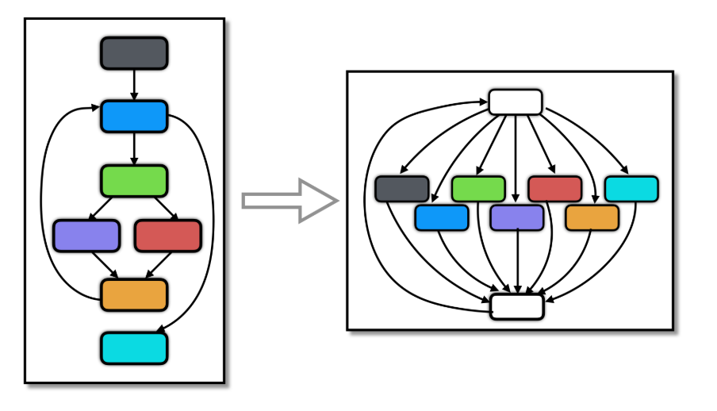

# Flatten transformation



**Sources**:
https://tigress.wtf/flatten.html

**Transformation**

**Comment Tigress fait la transformation Split**
(Options)

(Explication)

(Rq: ...)

En conclusion, ...

**Comment déobfusquer la transformation Split**

**Exemples**
(Détails de ce que l'on voit dans les exemples)

## Exemple de transformation d'un if
```c
// Original

```
```c
// Objfusqué par Split
```
```c
// Décompilé
```