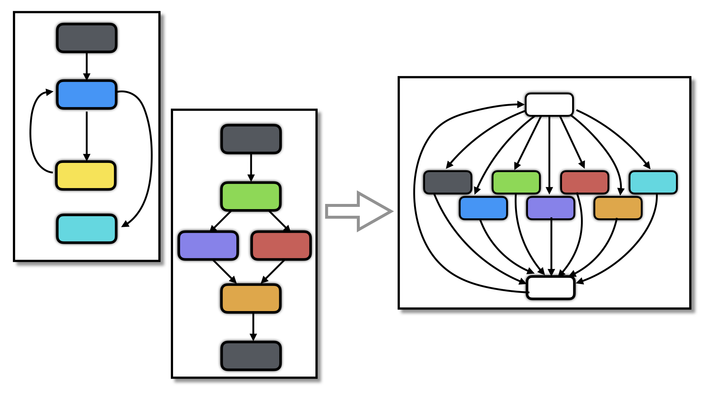

# Merge transformation



**Sources**:
https://tigress.wtf/merge.html

**Transformation**
La transformation **merge** permet de combiner plusieurs fonctions en une seule fonction.

**Comment Tigress fait la transformation Merge**
Tigress fusionne ensemble un certain nombre de fonctions (--Functions=\* => toute les fonctions, --Functions=%50 => la moitié des fonctions)
La nouvelle fonction contient la concatenation des parametres des autres fonctions plus un nouveau parametre. (les 
La nouvelle fonction est un branchement conditionnel sur la valeur de ce nouveau parametre. Chaque branche correspond a une ancienne fonction

RQ : Cette transformation est utile en amont de la virtualisation ou du jitting: si vous souhaitez virtualiser à la fois foo et bar, merger les d'abord, puis virtualisez le résultat
RQ : Il y a fusions des arguments des fonctions
RQ : Merge s'appuie sur Flatten (flatten puis merge par defaut sauf si on lui specifie de faire l'inverse)
RQ : Il est bien de run --Trandform=RndArgs apres un merge pour cacher le nouvel argument


**Message d'erreur rencontrés :**
```
This transformation cannot be applied to function(s) 'main' since it can only be applied to functions for which the signature may change
```
solution : Ne pas avoir de main 


**Exemples**
Voici le fichier que nous allons obfusquer en utilisation la transformation merge

``` c
#include "tigress.h"
#include <stdio.h>
#include <stdlib.h> 

void multiply(long long *factpointeur, int i) {
    *factpointeur *= i;
}

void ownprint(int number, long long *factpointeur) {
    printf("Factorial of %d is: %lld\n",number, *factpointeur);    
}

int test() {
	int i = 1;
	long long fact = 1;
	int number = 10;

	for(i=1; i <= number; i++) {
        multiply(&fact, i);
	}

    ownprint(number, &fact);
	return 0;  
}

```

En runnant la commande : 

``` 
tigress --Environment=x86_64:Linux:Gcc:4.6 \
  --Transform=Merge \
    --MergeFlatten=false \
    --Functions=\* \
  --out=merge_exemple1.c \
  /path_to_file/name_of_file.c
```

On obtient ce programme C obfusqué

``` c
void _1_multiply_ownprint_test(void *tigressRetVal , long long *factpointeur__0 ,
                               int i__1 , int whichBlock__5 ) 
{ 
  int i__2 ;
  long long fact__3 ;
  int number__4 ;

  {
  if (whichBlock__5 == 0) {
    *factpointeur__0 *= (long long )i__1;
    return;
  } else
  if (whichBlock__5 == 1) {
    printf((char const   */* __restrict  */)"Factorial of %d is: %lld\n", i__1, *factpointeur__0);
    return;
  } else
  if (whichBlock__5 == 2) {
    i__2 = 1;
    fact__3 = 1LL;
    number__4 = 10;
    i__2 = 1;
    while (i__2 <= number__4) {
      _1_multiply_ownprint_test(0, & fact__3, i__2, 0);
      i__2 ++;
    }
    _1_multiply_ownprint_test(0, & fact__3, number__4, 1);
    {
    *((int *)tigressRetVal) = 0;
    return;
    }
  } else {

  }
}
}
```

On voit bien que chacune des branches correspond

En runnant la commande : 

```
tigress --Environment=x86_64:Linux:Gcc:4.6 \
  --Transform=Merge \
    --MergeFlatten=false \
    --Functions=\* \
  --Transform
  --out=merge_exemple1.c \
  /path_to_file/name_of_file.c
```

On obtient ce programme C obfusqué

``` c
void MERGED(int whichBlock__5 , void *tigressRetVal , long long *factpointeur__0 ,
            int i__1 ) 
{ 
  int i__2 ;
  long long fact__3 ;
  int number__4 ;

  {
  if (whichBlock__5 == 0) {
    *factpointeur__0 *= (long long )i__1;
    return;
  } else
  if (whichBlock__5 == 1) {
    printf((char const   */* __restrict  */)"Factorial of %d is: %lld\n", i__1, *factpointeur__0);
    return;
  } else
  if (whichBlock__5 == 2) {
    i__2 = 1;
    fact__3 = 1LL;
    number__4 = 10;
    i__2 = 1;
    while (i__2 <= number__4) {
      MERGED(i__2, 0, 0, & fact__3);
      i__2 ++;
    }
    MERGED(number__4, 1, 0, & fact__3);
    {
    *((int *)tigressRetVal) = 0;
    return;
    }
  } else {

  }
}
}
```


