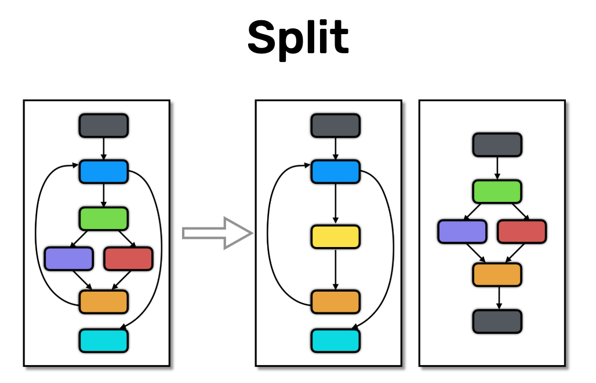

# Flatten transformation



**Sources**:
https://tigress.wtf/split.html

**Transformation**

**Comment Tigress fait la transformation Split**
(Options)

(Explication)

(Rq: ...)

En conclusion, ...

**Comment déobfusquer la transformation Split**

**Exemples**
(Détails de ce que l'on voit dans les exemples)

## Exemple de transformation d'un if
```c
// Original

```

<table style="max-width: 100%;"><tr><th>
Obfusqué
</th>
<th>
Décompilé
</th></tr>
<tr><td style="max-width: 350px;"><pre style="white-space: pre-wrap;">

</pre></td>
<td style="max-width: 350px"><pre style="white-space: pre-wrap;">

</pre></td></tr></table>