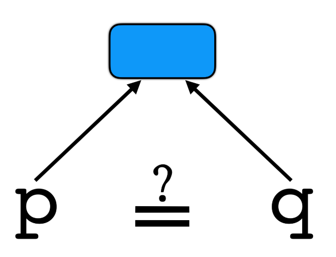
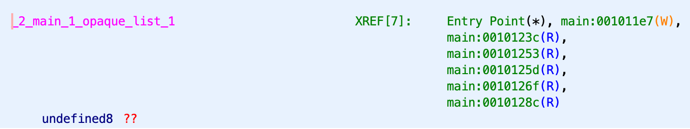

# Flatten transformation



**Sources**:
https://tigress.wtf/antiAliasAnalysis.html

**Transformation**
Cette transformation remplace les appels directs des fonctions en appels indirect en l'adresse de la fonction.
L'ensemble des adresses des fonctions sont contenues dans une liste et on accède à l'index de la fonction que l'on veut appeler par le calcul d'une expression.

Cela permet de faire face aux analyses inter-procédurales qui permet de recréer un graphe des appels des fonctions. (analyse des alias).

**Comment Tigress fait la transformation Split**
<table style="max-width: 100%;"><tr><th>
Obfusqué
</th>
<th>
Décompilé
</th></tr>
<tr><td style="max-width: 350px;"><pre style="white-space: pre-wrap;">
x = foo(n)
</pre></td>
<td style="max-width: 350px"><pre style="white-space: pre-wrap;">
void *arr[]  = {..., & foo, ... };

int main () {
   int x = ((int (*)(int n ))arr[expr=42])(n);
}
</pre></td></tr></table>

arr[] est la liste contenant les adresses des fonctions.

Une option permet d'utilise une expression opaque pour cacher/calculer l'index des adresses des fonctions dans la liste.
expr=42 est une expression opaque calculant l'index dans la liste de la fonction que l'on veut appeler.

Une option permet d'utiliser une "bogus function address".

Remarque:
Il faut faire cette transformation en dernier (car d'autres transformations ont besoin de l'analyse des alias pour obfusquer).
Il faut initialiser InitOpaque et InitEntropy.

```
tigress --Environment=x86_64:Linux:Gcc:4.6 \
--Transform=InitEntropy \
--Functions=main \
--InitEntropyKinds=vars \
--Transform=InitOpaque \
--Functions=main  \
--InitOpaqueStructs=list,array,env,input \
--Transform=AntiAliasAnalysis \
--Functions=main  \
--out=OUT.c \
IN.c
```

**Comment déobfusquer la transformation Split**
Déjà on pourra reconnaître que cette transformation est utilisé en voyant des morceaux `_2_main_1_opaque_ptr_1` `_3__functionPtrArray`, `(**(code **)`.

Il faudrait aux appels de fonction regarder l'adresse qui est appelée et remplacer par un alias pour que le décompilateur comprenne que c'est une fonction et qu'il l'analyse.

La difficulté est que la transformation utilise aussi les transformations Opaque qui rend encore plus difficile la lecture du code.

**Exemples**
Déjà on voit que dans la version décompilé, le décompilateur n'arrive pas à déterminer les fonctions appelées. Donc on a pas accès à ce qu'elles font.
On accède seulement à des structures/listes qui contiennent les adresses des fonctions appelées.



## Exemple de trasnformation d'un appel simple
```c
// Original
void call(){
  printf("call\n");
}

int main(int argc, char* argv[]) {
  call();
	return 0;
}
```

<table style="max-width: 100%;"><tr><th>
Obfusqué
</th>
<th>
Décompilé
</th></tr>
<tr><td style="max-width: 350px;"><pre style="white-space: pre-wrap;">
void call(void) {
  printf((char const   */* __restrict  */)"call\n");
  return;
}
}
int main(int argc , char **argv , char **_formal_envp ) { 
  int _BARRIER_0 ;
  struct _2_main_1_opaque_NodeStruct *p5 ;
  int i6 ;
  struct _2_main_1_opaque_NodeStruct *p7 ;
  int _2_main__BEGIN_1 ;
  int _2_main__END_1 ;
  int _2_main__BARRIER_2 ;
  {
  _BARRIER_0 = 1;
  {  /* __blockattribute__(__ATOMIC__)*/ 
  _2_main__BEGIN_1 = 1;
  p5 = (struct _2_main_1_opaque_NodeStruct *)malloc(sizeof(struct _2_main_1_opaque_NodeStruct ));
  p5->next = p5;
  p5->prev = p5;
  _2_main_1_opaque_list_1 = p5;
  i6 = 0;
  while (i6 < 4) {
    p7 = (struct _2_main_1_opaque_NodeStruct *)malloc(sizeof(struct _2_main_1_opaque_NodeStruct ));
    p7->data = i6 * ((_1_entropy & ~ 10) - (~ _1_entropy & 10));
    p7->next = _2_main_1_opaque_list_1->next;
    p7->prev = _2_main_1_opaque_list_1;
    (_2_main_1_opaque_list_1->next)->prev = p7;
    _2_main_1_opaque_list_1->next = p7;
    i6 ++;
  }
  _2_main_1_opaque_ptr_1 = _2_main_1_opaque_list_1->next;
  _2_main_1_opaque_ptr_2 = _2_main_1_opaque_ptr_1;
  _2_main_1_opaque_ptr_2 = _2_main_1_opaque_ptr_2->next;
  _2_main__END_1 = 1;
  }
  _2_main__BARRIER_2 = 1;
  ((void (*)(void))_3__functionPtrArray[(int )(_2_main__opaque_array[((unsigned int )(((_1_entropy | 7) + ((long )(_1_entropy | 7) >> 63L)) ^ ((long )(_1_entropy | 7) >> 63L)) % 10) * 3 + 0] % _2_main__opaque_array[5] + -3)])();
  return (0);
}
</pre></td>
<td style="max-width: 350px"><pre style="white-space: pre-wrap;">
undefined8 main(undefined4 param_1,undefined8 param_2,undefined8 param_3){
  uint uVar1;
  void **ppvVar2;
  int local_c;
  
  _2_main_1_opaque_list_1 = malloc(0x18);
  *(void **)((long)_2_main_1_opaque_list_1 + 8) = _2_main_1_opaque_list_1;
  *(void **)_2_main_1_opaque_list_1 = _2_main_1_opaque_list_1;
  local_c = 0;
  while (local_c < 4) {
    ppvVar2 = (void **)malloc(0x18);
    *(uint *)(ppvVar2 + 2) = (((uint)_1_entropy & 0xfffffff5) - (~(uint)_1_entropy & 10)) * local_c;
    ppvVar2[1] = *(void **)((long)_2_main_1_opaque_list_1 + 8);
    *ppvVar2 = _2_main_1_opaque_list_1;
    *(void ***)*(long ***)((long)_2_main_1_opaque_list_1 + 8) = ppvVar2;
    *(void ***)((long)_2_main_1_opaque_list_1 + 8) = ppvVar2;
    local_c = local_c + 1;
  }
  _2_main_1_opaque_ptr_1 = *(long *)((long)_2_main_1_opaque_list_1 + 8);
  _2_main_1_opaque_ptr_2 = *(undefined8 *)(_2_main_1_opaque_ptr_1 + 8);
  uVar1 = (uint)((long)_1_entropy >> 0x3f);
  (**(code **)(_3__functionPtrArray +
              (long)(int)(*(uint *)(_2_main__opaque_array +
                                   (ulong)(((((uint)_1_entropy | 7) + uVar1 ^ uVar1) % 10) * 3) * 4)
                          % _2_main__opaque_array._20_4_ - 3) * 8))();
  return 0;
}


</pre></td></tr></table>

## Exemple de transformation de différent appels de function (avec argument, avec retour..)
```c
// Original
void call(){
  printf("call\n");
}

int return_int(){
  return 1;
}

void call_arg(int a){
  printf("%d\n", a);
}

int main(int argc, char* argv[]) {
  call();
  int res = return_int();
  call_arg(res);
	return 0;
}
```

<table style="max-width: 100%;"><tr><th>
Obfusqué
</th>
<th>
Décompilé
</th></tr>
<tr><td style="max-width: 350px;"><pre style="white-space: pre-wrap;">
void call_arg(int a ) { 
  printf((char const   */* __restrict  */)"%d\n", a);
  return;
}
int return_int(void) { 
  return (1);
}
void call(void) { 
  printf((char const   */* __restrict  */)"call\n");
  return;
}
struct _2_main_1_opaque_NodeStruct {
   struct _2_main_1_opaque_NodeStruct *prev ;
   struct _2_main_1_opaque_NodeStruct *next ;
   int data ;
};
unsigned int _2_main__opaque_array[30]  = 
  { 438, 159, 3, 223, 439, 5, 313, 103, 
        5, 458, 544, 7, 323, 586, 21, 203, 
        404, 83, 203, 12, 1, 123, 635, 
        26, 108, 446, 78, 303, 54};
int main(int argc , char **argv , char **_formal_envp ) 
{ 
  int res ;
  int tmp ;
  int _BARRIER_0 ;
  struct _2_main_1_opaque_NodeStruct *p7 ;
  int i8 ;
  struct _2_main_1_opaque_NodeStruct *p9 ;
  int _2_main__BEGIN_1 ;
  int _2_main__END_1 ;
  int _2_main__BARRIER_2 ;
  _BARRIER_0 = 1;
  {  /* __blockattribute__(__ATOMIC__)*/ 
  _2_main__BEGIN_1 = 1;
  p7 = (struct _2_main_1_opaque_NodeStruct *)malloc(sizeof(struct _2_main_1_opaque_NodeStruct ));
  p7->next = p7;
  p7->prev = p7;
  _2_main_1_opaque_list_1 = p7;
  i8 = 0;
  while (i8 < 4) {
    p9 = (struct _2_main_1_opaque_NodeStruct *)malloc(sizeof(struct _2_main_1_opaque_NodeStruct ));
    p9->data = i8 * ((_1_entropy & ~ 10) - (~ _1_entropy & 10));
    p9->next = _2_main_1_opaque_list_1->next;
    p9->prev = _2_main_1_opaque_list_1;
    (_2_main_1_opaque_list_1->next)->prev = p9;
    _2_main_1_opaque_list_1->next = p9;
    i8 ++;
  }
  _2_main_1_opaque_ptr_1 = _2_main_1_opaque_list_1->next;
  _2_main_1_opaque_ptr_2 = _2_main_1_opaque_ptr_1;
  _2_main_1_opaque_ptr_2 = _2_main_1_opaque_ptr_2->next;
  _2_main__END_1 = 1;
  }
  _2_main__BARRIER_2 = 1;
  ((void (*)(void))_3__functionPtrArray[(int )(_2_main__opaque_array[((unsigned int )(((_1_entropy | 7) + ((long )(_1_entropy | 7) >> 63L)) ^ ((long )(_1_entropy | 7) >> 63L)) % 10) * 3 + 0] % _2_main__opaque_array[5] + -3)])();
  tmp = ((int (*)(void))_3__functionPtrArray[(int )(_2_main__opaque_array[((unsigned int )(((_1_entropy | 10) + ((long )(_1_entropy | 10) >> 63L)) ^ ((long )(_1_entropy | 10) >> 63L)) % 10) * 3 + 0] % _2_main__opaque_array[5] + -1)])();
  _3__functionPtrArray[(((_1_alwaysZero & (((_1_entropy ^ ~ 9) + ((_1_entropy | 9) << 1UL)) + 1UL)) * (_1_alwaysZero | (((_1_entropy ^ ~ 9) + ((_1_entropy | 9) << 1UL)) + 1UL)) + (_1_alwaysZero & ~ (((_1_entropy ^ ~ 9) + ((_1_entropy | 9) << 1UL)) + 1UL)) * (~ _1_alwaysZero & (((_1_entropy ^ ~ 9) + ((_1_entropy | 9) << 1UL)) + 1UL))) | 1) + (((_1_alwaysZero & (((_1_entropy ^ ~ 9) + ((_1_entropy | 9) << 1UL)) + 1UL)) * (_1_alwaysZero | (((_1_entropy ^ ~ 9) + ((_1_entropy | 9) << 1UL)) + 1UL)) + (_1_alwaysZero & ~ (((_1_entropy ^ ~ 9) + ((_1_entropy | 9) << 1UL)) + 1UL)) * (~ _1_alwaysZero & (((_1_entropy ^ ~ 9) + ((_1_entropy | 9) << 1UL)) + 1UL))) & 1)] = & p9;
  res = tmp;
  ((void (*)(int a ))_3__functionPtrArray[(((_1_alwaysZero & ((_1_entropy | 1) - (_1_entropy & 1))) * (_1_alwaysZero | ((_1_entropy | 1) - (_1_entropy & 1))) + (_1_alwaysZero & ~ ((_1_entropy | 1) - (_1_entropy & 1))) * (~ _1_alwaysZero & ((_1_entropy | 1) - (_1_entropy & 1)))) - ~ 3) - 1UL])(res);
  return (0);
}
}
</pre></td>
<td style="max-width: 350px"><pre style="white-space: pre-wrap;">

undefined8 main(undefined4 param_1,undefined8 param_2,undefined8 param_3){
  uint uVar1;
  void **local_38;
  uint local_30;
  uint local_2c;
  undefined4 local_28;
  undefined4 local_24;
  void *local_20;
  undefined4 local_14;
  undefined4 local_10;
  int local_c;
  
  local_10 = 1;
  local_14 = 1;
  _2_main_1_opaque_list_1 = malloc(0x18);
  *(void **)((long)_2_main_1_opaque_list_1 + 8) = _2_main_1_opaque_list_1;
  *(void **)_2_main_1_opaque_list_1 = _2_main_1_opaque_list_1;
  local_c = 0;
  local_20 = _2_main_1_opaque_list_1;
  while (local_c < 4) {
    local_38 = (void **)malloc(0x18);
    *(uint *)(local_38 + 2) = local_c * (((uint)_1_entropy & 0xfffffff5) - (~(uint)_1_entropy & 10))
    ;
    local_38[1] = *(void **)((long)_2_main_1_opaque_list_1 + 8);
    *local_38 = _2_main_1_opaque_list_1;
    *(void ***)*(long ***)((long)_2_main_1_opaque_list_1 + 8) = local_38;
    *(void ***)((long)_2_main_1_opaque_list_1 + 8) = local_38;
    local_c = local_c + 1;
  }
  _2_main_1_opaque_ptr_1 = *(long *)((long)_2_main_1_opaque_list_1 + 8);
  _2_main_1_opaque_ptr_2 = *(undefined8 *)(_2_main_1_opaque_ptr_1 + 8);
  local_24 = 1;
  local_28 = 1;
  uVar1 = (uint)((long)_1_entropy >> 0x3f);
  (**(code **)(_3__functionPtrArray +
              (long)(int)(*(uint *)(_2_main__opaque_array +
                                   (ulong)(((((uint)_1_entropy | 7) + uVar1 ^ uVar1) % 10) * 3) * 4)
                          % _2_main__opaque_array._20_4_ - 3) * 8))();
  uVar1 = (uint)((long)_1_entropy >> 0x3f);
  local_30 = (**(code **)(_3__functionPtrArray +
                         (long)(int)(*(uint *)(_2_main__opaque_array +
                                              (ulong)(((((uint)_1_entropy | 10) + uVar1 ^ uVar1) %
                                                      10) * 3) * 4) % _2_main__opaque_array._20_4_ -
                                    1) * 8))();
  *(void ****)
   (_3__functionPtrArray +
   (((_1_entropy * 2 | 0x12) + (_1_entropy ^ 0xfffffffffffffff6) + 1 & ~_1_alwaysZero) *
    (~((_1_entropy * 2 | 0x12) + (_1_entropy ^ 0xfffffffffffffff6) + 1) & _1_alwaysZero) +
    ((_1_entropy * 2 | 0x12) + (_1_entropy ^ 0xfffffffffffffff6) + 1 & _1_alwaysZero) *
    (_1_alwaysZero | (_1_entropy * 2 | 0x12) + (_1_entropy ^ 0xfffffffffffffff6) + 1) + 1) * 8) =
       &local_38;
  local_2c = local_30;
  (**(code **)(_3__functionPtrArray +
              (((_1_entropy ^ 1) & ~_1_alwaysZero) *
               ((_1_entropy ^ 0xfffffffffffffffe) & _1_alwaysZero) +
               ((_1_entropy ^ 1) & _1_alwaysZero) * (_1_alwaysZero | _1_entropy ^ 1) + 3) * 8))
            ((ulong)local_30,~_1_alwaysZero,
             *(code **)(_3__functionPtrArray +
                       (((_1_entropy ^ 1) & ~_1_alwaysZero) *
                        ((_1_entropy ^ 0xfffffffffffffffe) & _1_alwaysZero) +
                        ((_1_entropy ^ 1) & _1_alwaysZero) * (_1_alwaysZero | _1_entropy ^ 1) + 3) *
                       8));
  return 0;
}
</pre></td></tr></table>
