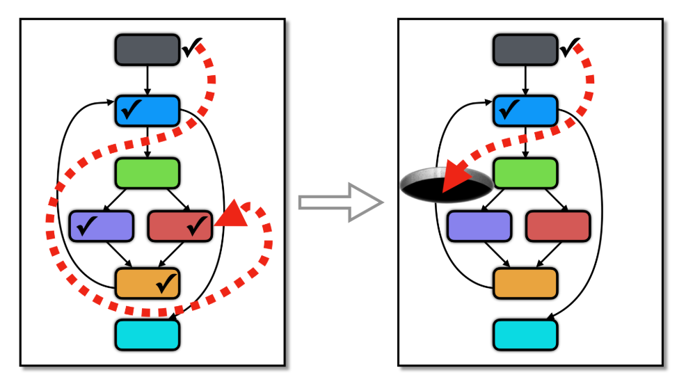

# Flatten transformation



**Sources**:
https://tigress.wtf/antiTaintAnalysis.html

**Transformation**
Cette transformation empêche l'analyse taint dynamique.

Taint = altérer, tacher
La taint analyse est le fait de voir l'influence des taint sources dans le programme. Par exemple l'influence d'un input utilisateur.

**Comment Tigress fait la transformation Split**
Tigress fait cette obfuscation en copiant la variable à obfusqué bout par bout dans une boucle.
On peut copier n'importe quelle variable et en particulier argc, argv ou les sortis de scanf, getpid.

Elle a besoin d'être initialiser par la transformation ImplicitFlow.

```bash
tigress --Environment=x86_64:Linux:Gcc:4.6 \
--Transform=InitImplicitFlow --Functions=main \
--Transform=AntiTaintAnalysis --Functions=main --AntiTaintAnalysisKinds=argv \
--out=antiTaintAnalysis_argc.c argc.c
```

```c
// Exemple copie d'un argc
argc_origPtr13 = (unsigned char *)(& argc);
argc_copyPtr15 = (unsigned char *)(& argc_copy14);
size_iter16 = 0;
while (size_iter16 < 4) {
  TempVar = 0;
  signal(31, handler);
  BitVar = 0;
  while (BitVar < 8) {
    if ((*argc_origPtr13 >> BitVar) & 1) {
      raise(31);
    } 
    BitVar ++;
  }
  signal(31, (void (*)(void *sig ))1);
  *argc_copyPtr15 = TempVar;
  argc_origPtr13 ++;
  argc_copyPtr15 ++;
  size_iter16 ++;
  }
```

**Comment déobfusquer la transformation Split**

**Exemples**
(Détails de ce que l'on voit dans les exemples)

## Exemple de copie d'un argc
```c
// Original
int main(int argc, char* argv[]) {
  printf("%d\n", argc);
	return 0;
}
```

<table style="max-width: 100%;"><tr><th>
Obfusqué
</th>
<th>
Décompilé
</th></tr>
<tr><td style="max-width: 350px;"><pre style="white-space: pre-wrap;">
int main(int argc , char **argv , char **_formal_envp ) 
{ 
  int _BARRIER_0 ;
  int _1__BARRIER_1 ;
  int _1__BARRIER_2 ;
  unsigned char *argc_origPtr7 ;
  int argc_copy8 ;
  unsigned char *argc_copyPtr9 ;
  int size_iter10 ;
  int charCopy11 ;
  int copy_iter12 ;
  char **arrayOfStringCopy_newArray13 ;
  int arrayOfStringCopy_iter14 ;
  char **arrayOfStringCopy_newArrayElmtPtr15 ;
  char *stringCopy_origPtr16 ;
  int stringCopy_strLen17 ;
  int exp_orig18 ;
  unsigned char *exp_orig18_origPtr19 ;
  int exp_orig18_copy20 ;
  unsigned char *exp_orig18_copyPtr21 ;
  int size_iter22 ;
  int charCopy23 ;
  int copy_iter24 ;
  char *stringCopy_orig25 ;
  char *stringCopy_copyPtr26 ;
  int charCopy27 ;
  int copy_iter28 ;

  {
  megaInit();
  _global_argc = argc;
  _global_argv = argv;
  _global_envp = _formal_envp;
  _BARRIER_0 = 1;
  _1__BARRIER_1 = 1;
  _1__BARRIER_2 = 1;
  arrayOfStringCopy_newArray13 = (char **)malloc(argc * 8);
  arrayOfStringCopy_newArrayElmtPtr15 = arrayOfStringCopy_newArray13;
  arrayOfStringCopy_iter14 = 0;
  while (arrayOfStringCopy_iter14 < argc) {
    stringCopy_strLen17 = (int )strlen(*(argv + arrayOfStringCopy_iter14));
    exp_orig18 = stringCopy_strLen17;
    exp_orig18_origPtr19 = (unsigned char *)(& exp_orig18);
    exp_orig18_copyPtr21 = (unsigned char *)(& exp_orig18_copy20);
    size_iter22 = 0;
    while (size_iter22 < 4) {
      charCopy23 = 0;
      copy_iter24 = 0;
      while (copy_iter24 < *exp_orig18_origPtr19) {
        charCopy23 ++;
        copy_iter24 ++;
      }
      *exp_orig18_copyPtr21 = (unsigned char )charCopy23;
      exp_orig18_origPtr19 ++;
      exp_orig18_copyPtr21 ++;
      size_iter22 ++;
    }
    stringCopy_orig25 = (char *)malloc(exp_orig18_copy20 + 1);
    stringCopy_origPtr16 = (char *)*(argv + arrayOfStringCopy_iter14);
    stringCopy_copyPtr26 = stringCopy_orig25;
    while (*stringCopy_origPtr16 != 0) {
      charCopy27 = 0;
      copy_iter28 = 0;
      while (copy_iter28 < *stringCopy_origPtr16) {
        charCopy27 ++;
        copy_iter28 ++;
      }
      *stringCopy_copyPtr26 = (unsigned char )charCopy27;
      stringCopy_origPtr16 ++;
      stringCopy_copyPtr26 ++;
    }
    *stringCopy_copyPtr26 = 0;
    *arrayOfStringCopy_newArrayElmtPtr15 = stringCopy_orig25;
    arrayOfStringCopy_newArrayElmtPtr15 ++;
    arrayOfStringCopy_iter14 ++;
  }
  argc_origPtr7 = (unsigned char *)(& argc);
  argc_copyPtr9 = (unsigned char *)(& argc_copy8);
  size_iter10 = 0;
  while (size_iter10 < 4) {
    charCopy11 = 0;
    copy_iter12 = 0;
    while (copy_iter12 < *argc_origPtr7) {
      charCopy11 ++;
      copy_iter12 ++;
    }
    *argc_copyPtr9 = (unsigned char )charCopy11;
    argc_origPtr7 ++;
    argc_copyPtr9 ++;
    size_iter10 ++;
  }
  printf((char const   */* __restrict  */)"%d\n", argc_copy8);
  return (0);
}
</pre></td>
<td style="max-width: 350px"><pre style="white-space: pre-wrap;">
undefined8 main(int param_1,long param_2,undefined8 param_3){
  size_t sVar1;
  int local_ac [4];
  int local_9c;
  undefined4 local_98;
  uint local_94;
  undefined *local_90;
  undefined4 local_84;
  undefined8 *local_80;
  undefined4 local_74;
  undefined4 local_70;
  undefined4 local_6c;
  int local_68;
  int local_64;
  undefined *local_60;
  int local_54;
  int local_50;
  int local_4c;
  int *local_48;
  undefined4 *local_40;
  char *local_38;
  undefined8 *local_30;
  int local_28;
  int local_24;
  int local_20;
  int local_1c;
  uint *local_18;
  int *local_10;
  
  local_ac[0] = param_1;
  megaInit();
  _global_argc = local_ac[0];
  local_6c = 1;
  local_70 = 1;
  local_74 = 1;
  _global_argv = param_2;
  _global_envp = param_3;
  local_80 = (undefined8 *)malloc((ulong)(uint)(local_ac[0] << 3));
  local_28 = 0;
  local_30 = local_80;
  while (local_28 < local_ac[0]) {
    sVar1 = strlen(*(char **)(param_2 + (long)local_28 * 8));
    local_98 = (undefined4)sVar1;
    local_40 = &local_98;
    local_48 = &local_9c;
    local_4c = 0;
    local_84 = local_98;
    while (local_4c < 4) {
      local_50 = 0;
      local_54 = 0;
      while (local_54 < (int)(uint)*(byte *)local_40) {
        local_50 = local_50 + 1;
        local_54 = local_54 + 1;
      }
      *(char *)local_48 = (char)local_50;
      local_40 = (undefined4 *)((long)local_40 + 1);
      local_48 = (int *)((long)local_48 + 1);
      local_4c = local_4c + 1;
    }
    local_90 = (undefined *)malloc((ulong)(local_9c + 1));
    local_38 = *(char **)(param_2 + (long)local_28 * 8);
    local_60 = local_90;
    while (*local_38 != '\0') {
      local_64 = 0;
      local_68 = 0;
      while (local_68 < *local_38) {
        local_64 = local_64 + 1;
        local_68 = local_68 + 1;
      }
      *local_60 = (char)local_64;
      local_38 = local_38 + 1;
      local_60 = local_60 + 1;
    }
    *local_60 = 0;
    *(undefined **)local_30 = local_90;
    local_30 = local_30 + 1;
    local_28 = local_28 + 1;
  }
  local_10 = local_ac;
  local_18 = &local_94;
  local_1c = 0;
  while (local_1c < 4) {
    local_20 = 0;
    local_24 = 0;
    while (local_24 < (int)(uint)*(byte *)local_10) {
      local_20 = local_20 + 1;
      local_24 = local_24 + 1;
    }
    *(char *)local_18 = (char)local_20;
    local_10 = (int *)((long)local_10 + 1);
    local_18 = (uint *)((long)local_18 + 1);
    local_1c = local_1c + 1;
  }
  printf("%d\n",(ulong)local_94);
  return 0;
}
</pre></td></tr></table>
