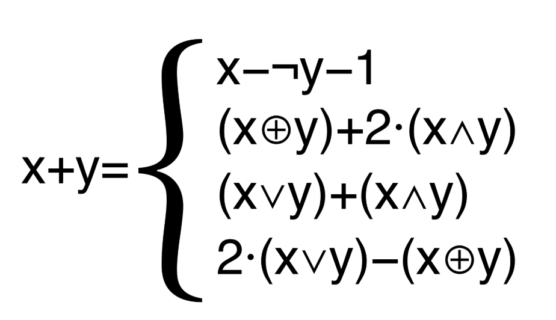

# Flatten transformation



**Sources**:
https://tigress.wtf/encodeArithmetic.html

**Transformation**
Cette transformation remplace un expression sur des entiers par une expression plus complexe.
```
// Entités
x + y = x - ¬ y - 1
      = (x ⊕ y) + 2·(x ∧ y) 
      = (x ∨ y) + (x ∧ y) 
      = 2·(x ∨ y) - (x ⊕ y) 
```

**Comment Tigress fait la transformation Split**
Pour l'instant Tigress ne peut que transformer des expressions sur des entiers.

Pour chaque opération, Tigress complexie l'expression en la transformant avec des expressions sur les bits et en la rallongeant.

**Comment déobfusquer la transformation Split**
On voit dans les exemples que les expressions sont obfusqués par des expressions plus compliqués mais seulement pour les expressions contenant des variables. Et pas pour l'opération diviser et modulo.

Lors de la décompilation, Ghidra ne met pas les lignes de code d'affectation et de calcul des valeurs des variables. 
Il remplace directement la variable avec sa valeur lorsquelle est utilisée. (Valeur pure, ou en hexa lorsqu'elle est négative).
(Il fait la même chose pour des expressions non obfusquées).
Donc cette obfuscation complique seulement la tâche car on perd le suivi des variables mais n'empêche pas la compréhension du programme car les valeurs sont pures.

Cela se complique si la valeur d'une expression n'est pas déterminée à la compilation.
Lorsque une variable est issue d'un argument du argv, tigress crée un variable temporaire qui prend sa valeur et obfusque l'opération cette variable.
Lors de la décompilation, Ghidra ne mettra donc plus la valeur pure de l'expression mais l'expression obfsuquée.
Pour déobfusqué cette transformation, il faut donc comprendre l'expression obfusqué  (symbole ~, ^ sur les bits ou autres..) et réussir à la réécrire plus simplement.

**Compréhension des opérateurs**
```c
^ // ou exclusif binaire (⊕)
| // ou inclusif binaire (∨)
& // et binaire (∧)
~ // négation binaire (¬)
<< et >> // décalage de bits
```

**Exemples**

## Exemple de transformation de différentes expressions arithmétiques

<table style="max-width: 100%;"><tr><th>
Original
</th>
<th>
Obfusqué
</th></tr>
<tr><td style="max-width: 350px;"><pre style="white-space: pre-wrap;">
int main() {
  int a = 1;
  int b = -1;
  int c = 10;

  int plus = a + b;
  int plus_simple = a + 5;
  int plus_simple2 = 3 + 5;
  int moins = b - c;
  int fois = a * b;
  int div = c / b;
  int mod = c % a;
  int complexe = a + b - 1 * 40;

  int not_determined = a + atoi(argv[1]);

  printf("%d\n", plus);
  printf("%d\n", plus_simple);
  printf("%d\n", div);
  printf("%d\n", complexe);
  printf("%d\n", not_determined);

  return 0;
}
</pre></td>
<td style="max-width: 350px"><pre style="white-space: pre-wrap;">
int main(int _formal_argc , char **_formal_argv , char **_formal_envp ) 
{ 
  int a ;
  int b ;
  int c ;
  int plus ;
  int plus_simple ;
  int moins ;
  int fois ;
  int div___0 ;
  int mod ;
  int complexe ;

  a = 1;
  b = -1;
  c = 10;

  plus = ((a | b) << 1) - (a ^ b);
  plus_simple = (a | 5) + (a & 5);
  plus_simple2 = 8;
  moins = (b & ~ c) - (~ b & c);
  fois = (a & b) * (a | b) + (a & ~ b) * (~ a & b);
  div___0 = c / b;
  mod = c % a;
  complexe = (((a - ~ b) - 1) & ~ 40) - (~ ((a - ~ b) - 1) & 40);

  tmp = atoi((char const   *)*(argv + 1));
  not_determined = ((a ^ ~ tmp) + ((a | tmp) + (a | tmp))) + 1;
  
  printf((char const   */* __restrict  */)"%d\n", plus);
  printf((char const   */* __restrict  */)"%d\n", plus_simple);
  printf((char const   */* __restrict  */)"%d\n", div___0);
  printf((char const   */* __restrict  */)"%d\n", complexe);
  return (0);
}
</pre></td></tr></table>

```c
// Décompilé
undefined8 main(undefined4 param_1,undefined8 param_2,undefined8 param_3)
{
  printf("%d\n",0);
  printf("%d\n",8);
  printf("%d\n",0xfffffff6);
  printf("%d\n",0xffffffd8);

  uVar1 = atoi(*(char **)(param_2 + 8));
  printf("%d\n",(ulong)((uVar1 | 1) * 2 + ~(uVar1 ^ 1) + 1));
  return 0;
}
```