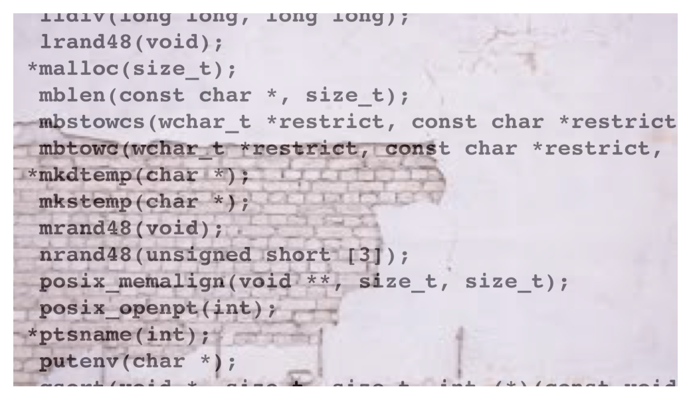

# Encode External transformation



**Sources**:
https://tigress.wtf/encodeExternal.html
https://linux.die.net/man/3/dlsym

**Transformation**
Cette transformation permet de cacher les appels systèmes ou les appels aux fonctions de librairies externes.

(rq : On Linux/gcc you need to explicitly add the -ldl option. On MacOS/clang this is not necessary. pour l'obfuscation et la compilation (tigress et gcc)
Cette option sert à l'édition de lien?)

**Comment Tigress fait la transformation Split**
Les appels à ces fonctions sont remplacés par des appels indirect en utilisant l'adresse de la fonction avec dlsym().

Il faut appeler les deux transformations InitEncodeExternal et EncodeExternal.
The InitEncodeExternal transformation uses dlsym() to load the system calls we want to hide by name,
the EncodeExternal transformation replaces the direct calls to the system calls in main()

```bash
tigress -ldl --Environment=x86_64:Linux:Gcc:4.6 \
--Transform=InitEncodeExternal --Functions=tigress_init --InitEncodeExternalSymbols=getpid,gettimeofday \
--Transform=EncodeExternal --Functions=main --EncodeExternalSymbols=getpid,gettimeofday  --out=encExter_call_external_init.c \
/media/sf_kali-sharedfolder/deobfuscation/projet-deobf/transformations/transformation_encode_external/call_external_init.c
```

**Comment déobfusquer la transformation Split**
Lors d'un appel system ou à une librairie externe sans obfuscation, le décompilateur arrive à retrouver le nom de la fonction directement.

**Exemples**

## Exemple de transformation d'appels 
```c
// Original
int main () {
  int x = getpid();
  printf("pid: %i\n", x);
  struct timeval tv;
  int y = gettimeofday(&tv, NULL);
  printf ("time of day: %ld.%06ld\n", tv.tv_sec, tv.tv_usec);
}
```

<table style="max-width: 100%;"><tr><th>
Obfusqué
</th>
<th>
Décompilé
</th></tr>
<tr><td style="max-width: 350px;"><pre style="white-space: pre-wrap;">
int main(int _formal_argc , char **_formal_argv , char **_formal_envp ) 
{ 
  int x ;
  __pid_t tmp ;
  struct timeval tv ;
  int y ;
  int tmp___0 ;
  void *externalAddr10 ;

  externalAddr10 = dlsym((void *)0, "gettimeofday");
  _1_main__externalFunctionPtrArray[0] = externalAddr10;
  externalAddr10 = dlsym((void *)0, "getpid");
  _1_main__externalFunctionPtrArray[1] = externalAddr10;
  tmp = ((__pid_t ( __attribute__((__leaf__)) (*))(void))_1_main__externalFunctionPtrArray[1])();
  x = tmp;
  printf((char const   */* __restrict  */)"pid: %i\n", x);
  tmp___0 = ((int ( __attribute__((__nonnull__(1), __leaf__)) (*))(struct timeval * __restrict  __tv ,
                                                                   __timezone_ptr_t __tz ))_1_main__externalFunctionPtrArray[0])((struct timeval */* __restrict  */)(& tv),
                                                                   (__timezone_ptr_t )((void *)0));
  y = tmp___0;
  printf((char const   */* __restrict  */)"time of day: %ld.%06ld\n", tv.tv_sec, tv.tv_usec);
  return (0);
}
</pre></td>
<td style="max-width: 350px"><pre style="white-space: pre-wrap;">
undefined8 main(undefined4 param_1,undefined8 param_2,undefined8 param_3){
  undefined8 local_38;
  undefined8 local_30;
  undefined4 local_28;
  undefined4 local_24;
  uint local_20;
  uint local_1c;
  code *local_18;
  undefined4 local_c;
  
  local_c = 1;

  _1_main__externalFunctionPtrArray._0_8_ = (code *)dlsym(0,"gettimeofday");
  local_18 = _1_main__externalFunctionPtrArray._0_8_;
  _1_main__externalFunctionPtrArray._8_8_ = (code *)dlsym(0,"getpid");
  local_18 = _1_main__externalFunctionPtrArray._8_8_;
  local_20 = (*_1_main__externalFunctionPtrArray._8_8_)();
  local_1c = local_20;
  printf("pid: %i\n",(ulong)local_20);
  local_28 = (*_1_main__externalFunctionPtrArray._0_8_)
                       (&local_38,0,_1_main__externalFunctionPtrArray._0_8_);
  local_24 = local_28;
  printf("time of day: %ld.%06ld\n",local_38,local_30);
  return 0;
}
</pre></td></tr></table>

## Exemple de transformation d'appels avec function d'initialisation (comme sur la doc)
```c
// Original
void tigress_init() {}
int main () {
  tigress_init();
  int x = getpid();
  printf("pid: %i\n", x);
  struct timeval tv;
  int y = gettimeofday(&tv, NULL);
  printf ("time of day: %ld.%06ld\n", tv.tv_sec, tv.tv_usec);
}
```

<table style="max-width: 100%;"><tr><th>
Obfusqué
</th>
<th>
Décompilé
</th></tr>
<tr><td style="max-width: 350px;"><pre style="white-space: pre-wrap;">
void tigress_init(void) 
{ 
  void *externalAddr1 ;
  externalAddr1 = dlsym((void *)0, "gettimeofday");
  _1_tigress_init__externalFunctionPtrArray[0] = externalAddr1;
  externalAddr1 = dlsym((void *)0, "getpid");
  _1_tigress_init__externalFunctionPtrArray[1] = externalAddr1;
  return;
}

int main(int _formal_argc , char **_formal_argv , char **_formal_envp ) 
{ 
  int x ;
  __pid_t tmp ;
  struct timeval tv ;
  int y ;
  int tmp___0 ;
  
  tigress_init();
  tmp = ((__pid_t ( __attribute__((__leaf__)) (*))(void))_1_tigress_init__externalFunctionPtrArray[1])();
  x = tmp;
  printf((char const   */* __restrict  */)"pid: %i\n", x);
  tmp___0 = ((int ( __attribute__((__nonnull__(1), __leaf__)) (*))(struct timeval * __restrict  __tv ,
                                                                   __timezone_ptr_t __tz ))_1_tigress_init__externalFunctionPtrArray[0])((struct timeval */* __restrict  */)(& tv),
                                                                   (__timezone_ptr_t )((void *)0));
  y = tmp___0;
  printf((char const   */* __restrict  */)"time of day: %ld.%06ld\n", tv.tv_sec, tv.tv_usec);
  return (0);
}
</pre></td>
<td style="max-width: 350px"><pre style="white-space: pre-wrap;">
void tigress_init(void){
  _1_tigress_init__externalFunctionPtrArray._0_8_ = dlsym(0,"gettimeofday");
  _1_tigress_init__externalFunctionPtrArray._8_8_ = dlsym(0,"getpid");
  return;
}

undefined8 main(undefined4 param_1,undefined8 param_2,undefined8 param_3){
  undefined8 local_38;
  undefined8 local_30;
  undefined4 local_1c;
  undefined4 local_18;
  uint local_14;
  uint local_10;
  undefined4 local_c;
  
  local_c = 1;

  tigress_init();
  local_14 = (*_1_tigress_init__externalFunctionPtrArray._8_8_)();
  local_10 = local_14;
  printf("pid: %i\n",(ulong)local_14);
  local_1c = (*_1_tigress_init__externalFunctionPtrArray._0_8_)
                       (&local_38,0,_1_tigress_init__externalFunctionPtrArray._0_8_);
  local_18 = local_1c;
  printf("time of day: %ld.%06ld\n",local_38,local_30);
  return 0;
}
</pre></td></tr></table>
