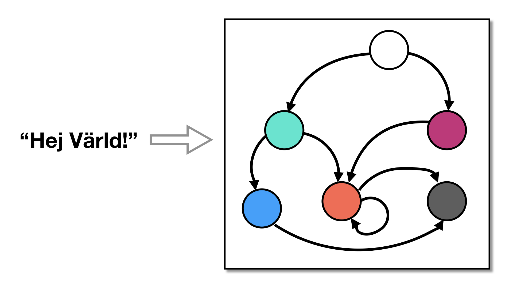

# Encode Literals transformation



**Sources**:
https://tigress.wtf/encodeLiterals.html

**Transformation**
Cette transformation remplace les chaines de caractere et les entiers par des expression plus complexes

**Comment Tigress fait la transformation Encode Literals**
//TODO
RQ : il faut run au préalable la transformation InitOpaque

**Comment déobfusquer la transformation Encode Literals**
//TODO

**Exemples**

## Exemple de transformation de différent appels de function (avec argument, avec retour..)
Voici le premier fichier que nous allons obfusquer en utilisation la transformation encode literals

``` c
#include <stdio.h>
#include "tigress.h"

int main(){
	printf("Hello");
	return 0;
}
```

En runnant la commande suivante pour encoder la chaine de caractere "Hello": 

``` 
tigress --Environment=x86_64:Linux:Gcc:4.6 \
  --Transform=InitOpaque \
  --Transform=EncodeLiterals \
    --EncodeLiteralsKinds=string \
  --out=encode_literals_exemple1.c \
  /path_to_file/name_of_file.c
```

On obtient ce programme C obfusqué

``` c
```

//COMMENTAIRE 

Reccommencons sur un deuxieme fichier C :

``` c
#include <stdio.h>
#include "tigress.h"

int main(){
    int a = 42;
	printf("%d", a);
	return 0;
}
``` 

Cette fois ci, on va demmander a Tigress d'encoder les entiers avec la commande suivante 

``` 
tigress --Environment=x86_64:Linux:Gcc:4.6 \
  --Transform=InitOpaque \
  --Transform=EncodeLiterals \
    --EncodeLiteralsKinds=integer \
  --out=encode_literals_exemple1.c \
  /path_to_file/name_of_file.c
```

On obtient ce programme C obfusqué

``` c
```

//COMMENTAIRES