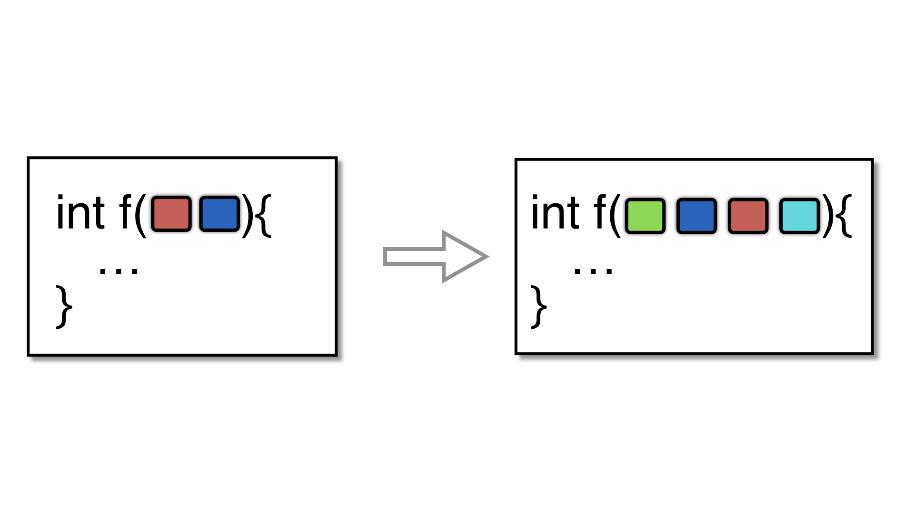

# Flatten transformation



**Sources**:
https://tigress.wtf/randomizeArguments.html

**Transformation**
```--Transform=RndArgs```

**Comment Tigress fait la transformation Randomize Arguments**
Options : 
- ```--Functions=function_name``` ==> specifie le nom de la fonction sur laquelle appliquer la transformation 
- ```--RndArgsBogusNo=2``` ==> specifie le nb d'arguments inutiles à rajouter a ladite fonction (defaut = 0)

Cette transformation change l'ordre des arguments des fonctions et ajoute des arguments inutile.  
RQ : Il est preconisé de run cette transformation après un merge pour perdre le nouvel argument introduit lors de cette dernière transformation.   
RQ : On peut aussi run cette transformation après un EncodeLitterals sur les strings pour masquer la signature de la fonction d'encodage de chaîne générée par cette dernière transformation.  
RQ : Attention on ne peut pas utiliser cette transformation sur des fonctions avec des varargs ```int f(int a, ...) ``` \n

**Comment déobfusquer la transformation Split**
- Au niveau de l'ordre des arguments, il n'y a pas grand chose à faire...
- Au niveau des arguments inutile, la decompilation de Ghidra les retire déjà 

## Exemple de transformation 
On part du fichier .c suivant :
```c
// Original
int function_with_3_args(int cpt, char* str, long long pow) {
    int len = sizeof(str);
    long long value = cpt * len * pow;
	printf("value : %lld", value);    
	return 0;
}
```

Dans un premier temps, nous allons tester la transformation RandomizeArgument sans spécifier d'option particulière.
```
tigress --Environment=x86_64:Linux:Gcc:4.6 \
    --Transform=RndArgs \
        --Functions=function_with_3_args \
    --out=randomize_args_exemple1.c \
    /path_to_file/file_name.c
```

<table style="width: 700px;">
    <tr>
        <th>Obfusqué</th>
        <th>Décompilé</th>
    </tr>
    <tr>
        <td style="max-width:350px;"><pre><code>
int function_with_3_args(char *str, long long pow, int cpt) { 
  int len;
  int tmp;
  long long value;
  tmp = strlen(str);
  len = tmp;
  value = (long long)(cpt * len) * pow;
  printf((char const  */* __restrict  */)"value : %lld", value);
  return (0);
}
        </code></pre></td>
        <td style="max-width: 350px"><pre>
undefined8 _function_with_3_args(char *param_1,long param_2,int param_3) {
    size_t sVar1;
    sVar1 = _strlen(param_1);
    _printf("value : %lld",(param_3 * (int)sVar1) * param_2);
    return 0;
}
        </pre></td>
    </tr>
</table>

RQ : Premierement rien avoir avec la transformation mais on remarque qu'à la décompilation ghidra converti les ```long long``` en ```long``` .

Dans un second temps, nous allons donc tester la transformation RandomizeArgument en specifiant a tigress de rajouter 2 arguments supplémentaires. 
```
tigress --Environment=x86_64:Linux:Gcc:4.6 \
    --Transform=RndArgs \
        --Functions=function_with_3_args \
        --RndArgsBogusNo=2 \
    --out=randomize_args_exemple2.c \
    /path_to_file/file_name.c
```

<table style="width: 700px;">
    <tr>
        <th>Obfusqué</th>
        <th>Décompilé</th>
    </tr>
    <tr>
        <td style="max-width:350px;"><pre>
int function_with_3_args(double bogus___1, long long pow, char *str, int cpt, void *bogus___2) { 
  int len;
  int tmp;
  long long value;
  tmp = strlen(str);
  len = tmp;
  value = (long long)(cpt * len) * pow;
  printf((char const  */* __restrict  */)"value : %lld", value);
  return (0);
}
        </pre></td>
        <td style="max-width: 350px"><pre>
undefined8 _function_with_3_args(long param_1,char *param_2,int param_3) {
    size_t sVar1;
    sVar1 = _strlen(param_2);
    _printf("value : %lld",(param_3 * (int)sVar1) * param_1);
    return 0;
}
        </pre></td>
    </tr>
</table>

RQ : On remarque que la decompilation de Ghidra retire d'elle meme les arguments inutilisés.
