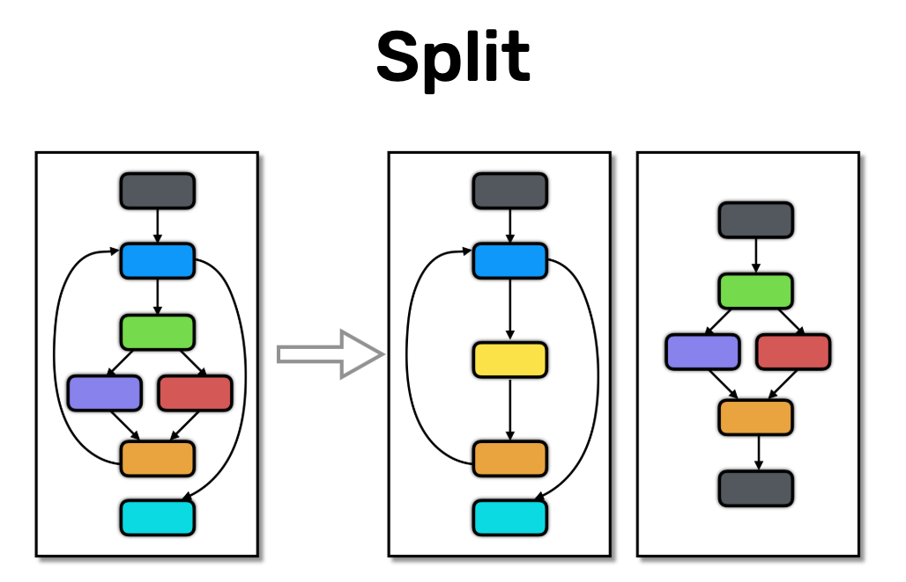

# Split transformation



**Sources**:
https://tigress.wtf/split.html

**Transformation**
La transformation **split** permet de décomposer une fonction en plusieurs sous-fonction.

**Comment Tigress fait la transformation Split**
Il y a plusieurs méthodes de split que l'on peut spécifier avec les options (Default=top,block,deep,recursive).
- top = split the top-level list of statements into two functions funcname_split_1 and funcname_split_2.
- block = split a basic block (list of assignment and call statements) into two functions.
- deep = split out a nested control structure of at least height>2 into its own function funcname_split_1.
- recursive = same as block, but calls to split functions are also allowed to be split out.
- level = split out a statement at a level specified by --SplitLevel.
- inside = split out a statement at the innermost nesting level.

Donc on comprend que tigress de base split le main() en 2 fonctions.
Chaque basic bloc (suite d'instructions qui seront tjrs faites dans le même ordre) sera split en 2 avec une partie pour les assignements et une autre pour les appels.
Chaque structure de contrôle est décomposée en sa propre fonction.
Enfin chaque sous-fonction pourra aussi être redécomposée.

(Rq: Le split deep ne décompose pas les structures de contrôlent en profondeur, elle les regroupe seulement dans des fonctions à part. La transformation "flatten" elle le permet.)
(On indique le nombre de split à faire, si il n'y a pas assez de code, une fonction splitté peut ne servir à rien ou juste faire un appel à une autre fonction).

En conclusion, cette transformation décompose la structure linéaire d'une fonction en plusieurs "blocs" de code qui seront éparpillés dans divers appels de fonction qui peuvent être nested, pour compliquer la lecture du code.

**Comment déobfusquer la transformation Split**
Le décompilateur arrive a bien décompiler cette transformation. 
Pour revenir au code original, il suffit de remplacer les appels de fonction par leur code.
Nous pensons que cela peut s'automatiser.

**Exemples**
Dans les exemples ci-dessous, on arrive à bien voir la séparation des fonctions avec celles qui gèrent les assignments et les autres pour les instructions.

## Exemple de transformation d'un if
```c
// Original
int main(){
  int condition = 1;
  if(condition == 1 ) {
    printf("true");
  } else {
    printf("false");
  }
  return 0;
}
```
```c
// Objfusqué par Split
void _1_main_main_split_1(int *condition ){
    {
    *condition = 1;
    }
}

void _1_main_main_split_2(int *condition ){
  {
    if (*condition == 1) {
      printf((char const   */* __restrict  */)"true");
    } else {
      printf((char const   */* __restrict  */)"false");
    }
  }
}

int main(int _formal_argc , char **_formal_argv , char **_formal_envp ) 
{ 
  int condition ;
  int _BARRIER_0 ;

  {
  megaInit();
  _global_argc = _formal_argc;
  _global_argv = _formal_argv;
  _global_envp = _formal_envp;
  _BARRIER_0 = 1;
  _1_main_main_split_1(& condition);
  _1_main_main_split_2(& condition);
  return (0);
}
```
```c
// Décompilé
void _1_main_main_split_1(undefined4 *param_1){
  *param_1 = 1;
  return;
}

void _1_main_main_split_2(int *param_1){
  if (*param_1 == 1) {
    printf("true");
  }
  else {
    printf("false");
  }
  return;
}

undefined8 main(undefined4 param_1,undefined8 param_2,undefined8 param_3){
  undefined local_10 [4];
  undefined4 local_c;
  
  megaInit();
  local_c = 1;
  _global_argv = param_2;
  _global_argc = param_1;
  _global_envp = param_3;
  _1_main_main_split_1(local_10);
  _1_main_main_split_2(local_10);
  return 0;
}
```

## Exemple d'un if_arg

```c
// Original
int main(int argc, char* argv[]){
  if(strcmp(argv[1], "1") == 0 ) {
    printf("true\n");
  } else {
    printf("false\n");
  }
  return 0;
}
```

```c
// Obfusqué
void _1_main_main_split_1(char ***argv , int *tmp ){
  {
    *tmp = strcmp((char const   *)*(*argv + 1), "1");
  }
}

void _1_main_main_split_2(int *tmp ){
  {
    if (*tmp == 0) {
      printf((char const   */* __restrict  */)"true\n");
    } else {
      printf((char const   */* __restrict  */)"false\n");
    }
  }
}

int main(int argc , char **argv , char **_formal_envp ){ 
  int tmp ;
  int _BARRIER_0 ;

  {
    megaInit();
    _global_argc = argc;
    _global_argv = argv;
    _global_envp = _formal_envp;
    _BARRIER_0 = 1;
    _1_main_main_split_1(& argv, & tmp);
    _1_main_main_split_2(& tmp);
    return (0);
  }
}
```

```c
// Décompilé
void _1_main_main_split_1(long *param_1,int *param_2){
  int iVar1;
  
  iVar1 = strcmp(*(char **)(*param_1 + 8),"1");
  *param_2 = iVar1;
  return;
}

void _1_main_main_split_2(int *param_1){
  if (*param_1 == 0) {
    puts("true");
  }
  else {
    puts("false");
  }
  return;
}

undefined8 main(undefined4 param_1,undefined8 param_2,undefined8 param_3){
  undefined8 local_28;
  undefined4 local_1c;
  undefined local_10 [4];
  undefined4 local_c;
  
  local_28 = param_2;
  local_1c = param_1;
  megaInit();
  _global_argc = local_1c;
  _global_argv = local_28;
  local_c = 1;
  _global_envp = param_3;
  _1_main_main_split_1(&local_28,local_10,local_10);
  _1_main_main_split_2(local_10);
  return 0;
}
```

## Exemple avec des if nested (avec nb de split paramatré à 5)

```c
// Original
int main(int argc, char* argv[]){
  int a = 1;
  char* b = "yes";
  unsigned long c = -1;
  if(strcmp(argv[1], "1") == 0 ) {
    if(1){
      if(a == 1) {
        if(strcmp(b, "yes") == 0) {
          printf("b true\n");
        } else if (c == -1) {
          printf("c true\n");
        } else {
          printf("a true\n");
        }
      }
    } else {
      printf("a false\n");
    }
  }
  return 0;
}
```

```c
// Obfusqué
void _1_main_main_split_2(int *a , char **b , unsigned long *c ) 
{ 
  *a = 1;
  *b = (char *)"yes";
  *c = 18446744073709551615;
}
void _1_main_main_split_4(char ***argv , int *a , char **b , unsigned long *c , int *tmp___0 ) 
{ 
  _1_main_main_split_2(& *a, & *b, & *c);
  _1_main_main_split_3(& *argv, & *tmp___0);
}
void _1_main_main_split_1(int *a , char **b , unsigned long *c , int *tmp , int *tmp___0 ) 
{ 
  if (*tmp___0 == 0) {
    if (*a == 1) {
      *tmp = strcmp((char const   *)*b, "yes");
      if (*tmp == 0) {
        printf((char const   */* __restrict  */)"b true\n");
      } else
      if (*c == 18446744073709551615) {
        printf((char const   */* __restrict  */)"c true\n");
      } else {
        printf((char const   */* __restrict  */)"a true\n");
      }
    }
  }
}
void _1_main_main_split_3(char ***argv , int *tmp___0 ) { 
  *tmp___0 = strcmp((char const   *)*(*argv + 1), "1");
}
void _1_main_main_split_5(int *a , char **b , unsigned long *c , int *tmp , int *tmp___0 ) { 
  _1_main_main_split_1(& *a, & *b, & *c, & *tmp, & *tmp___0);
}
int main(int argc , char **argv , char **_formal_envp ) { 
  int a ;
  char *b ;
  unsigned long c ;
  int tmp ;
  int tmp___0 ;
  int _BARRIER_0 ;

  megaInit();
  _global_argc = argc;
  _global_argv = argv;
  _global_envp = _formal_envp;
  _BARRIER_0 = 1;
  _1_main_main_split_4(& argv, & a, & b, & c, & tmp___0);
  _1_main_main_split_5(& a, & b, & c, & tmp, & tmp___0);
  return (0);
}
```

```c
// Décompilé
void _1_main_main_split_1(int *param_1,char **param_2,long *param_3,int *param_4,int *param_5){
  int iVar1;
  if ((*param_5 == 0) && (*param_1 == 1)) {
    iVar1 = strcmp(*param_2,"yes");
    *param_4 = iVar1;
    if (*param_4 == 0) {
      puts("b true");
    }
    else {
      if (*param_3 == -1) {
        puts("c true");
      }
      else {
        puts("a true");
      }
    }
  }
  return;
}

void _1_main_main_split_2(undefined4 *param_1,undefined8 *param_2,undefined8 *param_3){
  *param_1 = 1;
  *param_2 = 0x102004;
  *param_3 = 0xffffffffffffffff;
  return;
}

void _1_main_main_split_3(long *param_1,int *param_2){
  int iVar1;
  iVar1 = strcmp(*(char **)(*param_1 + 8),"1");
  *param_2 = iVar1;
  return;
}

void _1_main_main_split_4
               (undefined8 param_1,undefined8 param_2,undefined8 param_3,undefined8 param_4,
               undefined8 param_5){
  _1_main_main_split_2(param_2,param_3,param_4,param_3);
  _1_main_main_split_3(param_1,param_5,param_5);
  return;
}

void _1_main_main_split_5
               (undefined8 param_1,undefined8 param_2,undefined8 param_3,undefined8 param_4,
               undefined8 param_5){
  _1_main_main_split_1(param_1,param_2,param_3,param_4,param_5);
  return;
}

undefined8 main(undefined4 param_1,undefined8 param_2,undefined8 param_3){
  undefined8 local_38;
  undefined4 local_2c;
  undefined local_28 [4];
  undefined local_24 [4];
  undefined local_20 [8];
  undefined local_18 [8];
  undefined local_10 [4];
  undefined4 local_c;
  
  local_38 = param_2;
  local_2c = param_1;
  megaInit();
  _global_argc = local_2c;
  _global_argv = local_38;
  local_c = 1;
  _global_envp = param_3;
  _1_main_main_split_4(&local_38,local_10,local_18,local_20,local_28);
  _1_main_main_split_5(local_10,local_18,local_20,local_24,local_28);
  return 0;
}
```

